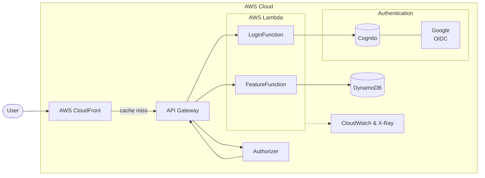
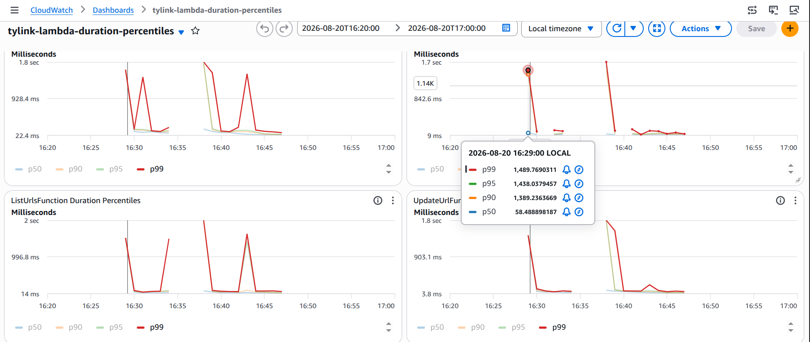

# tylink

A serverless URL shortener on AWS

## Highlights

- **Load-tested loop with K6** — see [Load test results](#load-test-results)
  below.
- **CDN enabled**: CloudFront serve about 80% of redirecting URL requests
- **Rate & Burst limit**: each endpoint has a separate token bucket
- **Idempotency**: Shorten URLs without duplicate
- **Single-table DynamoDB design**
- **IdP federation**: Login by Google via AWS Cognito
- **AWS-native observability**: X-Ray tracing, custom EMF metrics, CloudWatch dashboards, and a CloudWatch alarm

## Architecture



## Tech stack

| Layer | Choices |
|---|---|
| Compute | Java, AWS Lambda |
| API | AWS API Gateway  |
| CDN | CloudFront |
| Data | DynamoDB |
| Auth | Cognito User |
| Observability | X-Ray, CloudWatch, Lambda Powertools |
| IaC | AWS SAM |
| Testing | JUnit, Mockito, K6 |

## Load test results
When Lambda warmed up, we achieve this:
| Scenario | p50 | p90 | p99 | SLO (p99 < 1000ms) |
|---|---|---|---|---|
| Hot (cache hit) | 5.21ms | 6.22ms | 8.85ms | ✓ Pass |
| Cold (cache miss) | 5.17ms | 7.43ms | 763.44ms | ✓ Pass |
| Auth + CRUD | 354.2ms | 832.28ms | 915.2ms | ✓ Pass |

Warm up overhead are still high even we restore from Snapshot


## Getting started

Prerequisites: [SAM CLI](https://docs.aws.amazon.com/serverless-application-model/latest/developerguide/serverless-sam-cli-install.html),
Java 21, Maven, Docker (for local runs and integration tests), AWS credentials.

```bash
sam build
sam local start-api --port 3000
cd functions && mvn test
```

Full command reference — build, local run, test, deploy, logs — is in
[`CLAUDE.md`](CLAUDE.md).

## Docs

- [`docs/plans/00-overview.md`](docs/plans/00-overview.md) — requirements, decisions, budget constraints
- [`docs/technical_decisions/`](docs/technical_decisions/) — 15 ADRs
- [`docs/learning/`](docs/learning/) — notes written while learning the concepts behind each decision
- [`docs/reports/`](docs/reports/) — load-test methodology and full results
