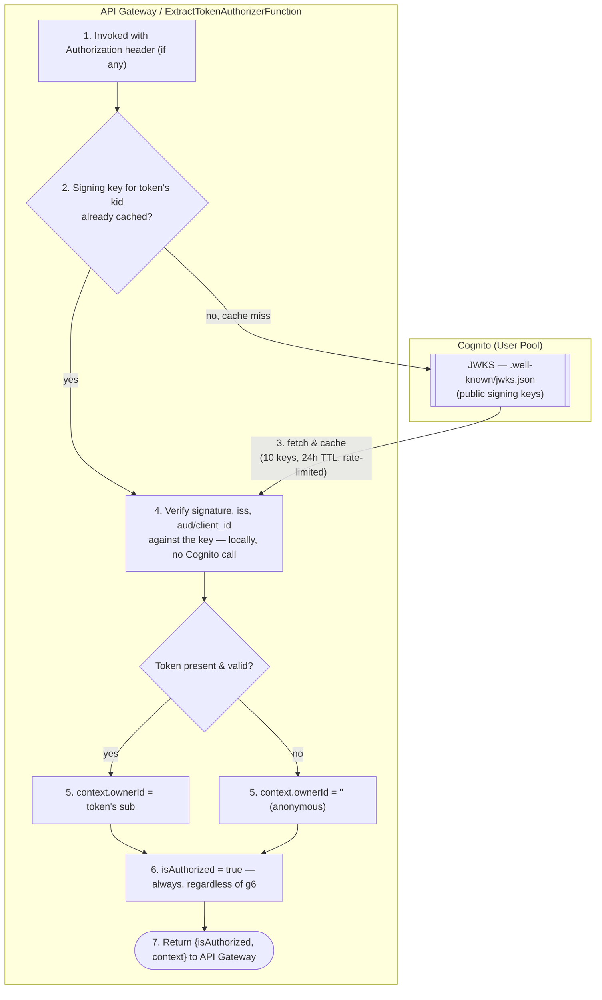

# Cognito Features Behind the Extract-Token Lambda Authorizer

Which Cognito pieces `ExtractTokenAuthorizerFunction` depends on, and how `template.yaml` wires them
together. See `../technical_decisions/05-custom-jwt-authorizer.md` for *why* the authorizer exists.

---

## 1. User Pool vs. Identity Pool

- **User Pool** — user directory; issues JWTs (ID/access/refresh) after sign-in.
- **Identity Pool** — exchanges a token for temporary AWS IAM credentials.

TyLink only uses a **User Pool** (`UserPool` in `template.yaml`). Lambdas call DynamoDB with their
own execution-role credentials, not the caller's — the User Pool's only job is issuing JWTs that
`CognitoJwtVerifier` can verify.

## 2. User Pool config

```yaml
UserPool:
  Properties:
    UsernameAttributes: [email]
    AutoVerifiedAttributes: [email]
```

- `UsernameAttributes: [email]` — sign in by email. This is also why `sub`, not email, is the id
  the verifier trusts: it never changes even if the user's email does.
- `AutoVerifiedAttributes: [email]` — verification isn't the same gate as authentication (unverified
  accounts can still sign in), so the authorizer never checks `email_verified`.

## 3. User Pool Client and auth flows

```yaml
UserPoolClient:
  Properties:
    GenerateSecret: false
    ExplicitAuthFlows: [ALLOW_USER_PASSWORD_AUTH, ALLOW_USER_SRP_AUTH, ALLOW_REFRESH_TOKEN_AUTH]
```

- `GenerateSecret: false` — the client runs in a browser/app, so there's no secret it could keep
  hidden.
- `ExplicitAuthFlows` — `ALLOW_USER_PASSWORD_AUTH` (dev convenience), `ALLOW_USER_SRP_AUTH`
  (production — password never crosses the wire), `ALLOW_REFRESH_TOKEN_AUTH` (mint new tokens
  without re-authenticating).

None of these flows are exercised by the authorizer — it only verifies tokens someone else already
obtained. They matter here only because `USER_POOL_CLIENT_ID` is exactly what
`CognitoJwtVerifier.isTrustedAudience()` checks the token's audience against.

## 4. What the authorizer actually checks

No Cognito API call happens at request time — everything needed is embedded in the token or
fetched once and cached:

- **Issuer (`iss`)** — `https://cognito-idp.<region>.amazonaws.com/<userPoolId>`, built from
  `USER_POOL_ID` + `AWS_REGION`; doubles as the JWKS lookup URL.
- **JWKS** — the pool's public signing keys at `<issuer>/.well-known/jwks.json`, fetched via
  `JwkProviderBuilder` and cached (10 keys, 24h TTL) — steady state makes zero Cognito calls.
- **Audience (`aud` / `client_id`)** — ID tokens carry the standard `aud` claim; **access** tokens
  use a non-standard `client_id` claim instead (no `aud`) — a Cognito/OAuth quirk, which is why
  `isTrustedAudience()` branches on `token_use`.
- **Subject (`sub`)** — the pool-assigned, immutable user id, forwarded as `ownerId`. TyLink never
  stores or compares email addresses for ownership.

## 5. Wiring in `template.yaml`

```
UserPool ──► UserPoolClient ──► ExtractTokenAuthorizerFunction (env vars: USER_POOL_ID, USER_POOL_CLIENT_ID)
                                            │ FunctionArn
                                            ▼
                          HttpApi.Auth.Authorizers.ExtractTokenAuthorizer
                                            │ Auth.Authorizer: ExtractTokenAuthorizer
                                            ▼
                                ShortenUrlFunction's HttpApi Event (POST /v1/urls)
```

- The function is registered as a **REQUEST-type** authorizer with `AuthorizerPayloadFormatVersion:
  "2.0"` + `EnableSimpleResponses: true`, which is what lets it return the terse
  `{isAuthorized, context}` shape instead of a full IAM policy document.
- `ShortenUrlFunction`'s event is the only route that opts in (`Auth.Authorizer:
  ExtractTokenAuthorizer`) — it's a per-route reference, not an API-wide default.
  `DecodeUrlFunction`'s event has no `Auth` block, so it runs fully open with no authorizer.
- At request time API Gateway invokes the authorizer first, then — because `isAuthorized` is always
  `true` — always proceeds to `ShortenUrlFunction`, injecting the authorizer's `context` map at
  `requestContext.authorizer.lambda`. See `events/shortenPrivateUrl.json` /
  `shortenPrivateUrl.invalidToken.json` for that shape with and without a verified caller.

## 6. Logical flow: Custom Authorizer ↔ Cognito



The only runtime call to Cognito is the JWKS fetch on a cache miss (step 3); everything else is
local. Step `g9` is the crux of the design: `isAuthorized` is `true` unconditionally — the `g6`
branch only decides `context.ownerId`, never whether the request is let through. Reverse that (tie
`isAuthorized` to verification success) and every anonymous caller gets a 403 straight from API
Gateway, `ShortenUrlFunction` never runs, and the authorizer stops being "optional."

## 7. Why not a native `JWT` authorizer

API Gateway can declare a Cognito User Pool directly as a `JWT`-type authorizer, with zero custom
code. Not used here because it's all-or-nothing per route: a missing/invalid token gets a 401
before any Lambda runs, with no way to say "verify if present, otherwise continue as anonymous."
`POST /v1/urls` needs exactly that, since it accepts both anonymous (`PUBLIC`) and authenticated
(`PRIVATE`) requests on the same route. Full reasoning in
`../technical_decisions/05-custom-jwt-authorizer.md`.
