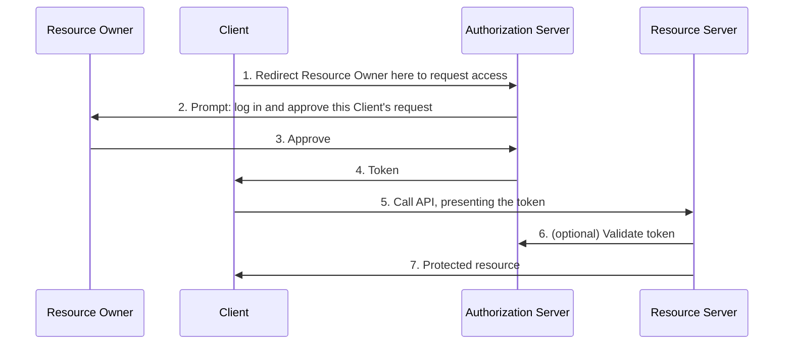
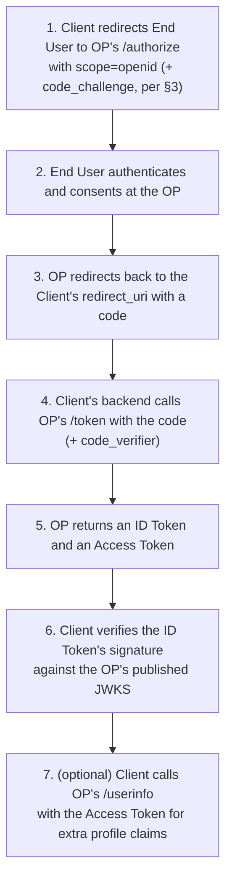
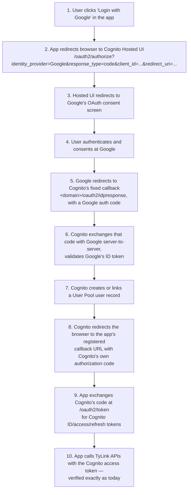

# OAuth2 and OIDC — Prerequisites for Google Login via Cognito

`docs/plans/01-implementation.md` calls for Google as a federated IdP on the Cognito User Pool,
alongside the username/password login `LoginHandler` already implements. Federated login is a
redirect-based flow with no precedent yet in this codebase, so this doc builds up the OAuth2/OIDC
concepts needed to understand it before touching `template.yaml`. It does not re-cover User Pool
vs. Identity Pool or why the custom Lambda authorizer exists — see
`05-cognito-and-lambda-authorizers.md` and `../technical_decisions/05-custom-jwt-authorizer.md`.

---

## 1. What OAuth2 Solves & Core Roles

OAuth2 lets a **Client** act on a **Resource Owner**'s behalf against a **Resource Server**,
without the Resource Owner handing the Client their password. Four roles:

- **Resource Owner** — the human who owns the data/account being accessed.
- **Client** — the app requesting access on the Resource Owner's behalf.
- **Authorization Server (AS)** — authenticates the Resource Owner and issues tokens to the Client.
- **Resource Server (RS)** — hosts the protected resource the Client wants to call.



The AS and RS are often the same company but different systems (e.g. both run by Google), and
sometimes the same Client plays AS-broker for a *different* AS entirely — that's exactly TyLink's
shape once Google federation lands (§8).

**Real-world scenarios**, same four roles each time:

- **A photo-printing site reading your Google Photos.** Resource Owner: you. Client: the
  printing site. AS + RS: Google. The printing site gets a token scoped to "read your photos" and
  never sees your Google password.
- **A GitHub Actions workflow accessing a private repo.** Resource Owner: the repo owner. Client:
  the CI job. AS + RS: GitHub. The job authenticates with a token scoped to specific repo
  permissions, not the owner's actual GitHub credentials.
- **Calendly reading and writing your Google Calendar.** Resource Owner: you. Client: Calendly.
  AS + RS: Google. Revoking Calendly's access later (Google Account → Third-party access) doesn't
  touch your Google password at all — because Calendly never had it.

## 2. Authorization Code Grant

The Client never sees the Resource Owner's credentials. Instead it gets a short-lived, single-use
**authorization code** delivered via browser redirect, then exchanges that code for tokens in a
separate, direct call to the AS.

Worked example — "Login with Google" on a third-party site:

1. Browser hits the third-party site; it redirects to Google's `/authorize` endpoint with its
   `client_id`, requested `scope`, and a `redirect_uri` it registered in advance.
2. The user authenticates *at Google's own login page* — the third-party site's code never runs
   here, never sees the password field.
3. Google redirects the browser back to `redirect_uri` with a `code` query parameter.
4. The third-party site's **backend** (not the browser) calls Google's `/token` endpoint directly,
   server-to-server, presenting the `code` plus its own `client_id`/`client_secret`, and gets back
   tokens in the response body.

**Why step 4 is a separate server-to-server call instead of Google just handing back tokens in the
redirect URL**: redirect URLs end up in browser history, `Referer` headers, and proxy/server access
logs. A long-lived token sitting in a URL is a token leaked. The `code` in step 3 is deliberately
short-lived and single-use, so even if it leaks the same way, it's worthless *unless the leaker can
also complete step 4*. On mobile that "unless" isn't hypothetical — which is exactly the gap §3
closes.

## 3. PKCE

**The gap**: two apps on the same phone can register the same custom URL scheme (say,
`tylink://callback`) to receive the redirect in step 3 above. If a malicious app registers that
scheme too, it can receive the authorization code intended for the legitimate app. Without anything
else in place, that's enough — the malicious app just replays the code in step 4 and gets tokens
for someone else's session.

**The fix, worked through**:

1. Before redirecting to `/authorize`, the legitimate client generates a random string and keeps it
   in memory only — the `code_verifier`, e.g. `dBjftJeZ4CVP-mB92K27uhbUJU1p1r_wW1gFWFOEjXk`.
2. It computes `code_challenge = BASE64URL(SHA256(code_verifier))` and sends *that* (not the
   verifier) in the `/authorize` redirect. The AS stores the challenge alongside the code it's about
   to issue.
3. When redeeming the code at `/token` (step 4 above), the client must also send the original
   `code_verifier`. The AS re-hashes it and checks the result matches the `code_challenge` it stored
   in step 2.

The malicious app from the gap scenario intercepts the code in step 3 of §2, but it never had the
`code_verifier` — that value was generated and held only in the legitimate app's memory in step 1
above. Its token exchange fails at step 3 here. PKCE doesn't hide the code; it makes possession of
the code alone insufficient.

This is why PKCE matters for `UserPoolClient` specifically: it has `GenerateSecret: false` (see
`05-cognito-and-lambda-authorizers.md` §3) — a browser/app client with no secret to prove "I'm the
real client" at the token endpoint. PKCE's `code_verifier` is exactly that proof, generated fresh
per login instead of baked into the client. Cognito Hosted UI applies it automatically to every
Authorization Code exchange; nothing to configure.

## 4. Client Credentials (for completeness)

No Resource Owner at all: the Client authenticates as *itself* — `client_id` + `client_secret` —
directly to the AS and gets a token representing the Client's own identity, not a user's. Used for
machine-to-machine calls with no human in the loop, e.g. a backend cron job calling a partner API
under its own service identity. Doesn't apply to TyLink's login use case, since every flow here
starts with a human signing in — included only to complete the grant-type picture.

## 5. Where OAuth2 Falls Short — and Where OIDC Shines

**The failure scenario**: an app receives an OAuth2 access token and treats that as proof "this
user just authenticated to me." OAuth2 never actually promises that. Access tokens are
opaque-by-spec — no required format, no standard claims, no mandated audience field — because they
were only ever designed to mean "the bearer may call this API." Nothing in the OAuth2 spec stops a
token minted for API A from being replayed as if it were login proof for app B; the spec simply
never defines who a token identifies or when they authenticated. That gap is a real attack class
(token-substitution/"mix-up" attacks: an app is tricked into accepting a token issued by, or for, a
different party than it assumes).

**Where OIDC closes it**: the **ID Token** is a *signed JWT* with a mandatory, standardized claim
set — `iss` (who issued it), `sub` (who authenticated), `aud` (which client it's for), `exp`/`iat`
(when it's valid). The Client verifies the signature itself, locally, against the issuer's published
keys — no extra API call, no trusting the transport. Where an OAuth2 access token is opaque and
silent about identity, an OIDC ID token is a self-contained, cryptographically checkable statement
of exactly that.

## 6. ID Token vs. Access Token

| | ID Token | Access Token |
|---|---|---|
| Answers | Who authenticated? | What can the bearer call? |
| Audience claim | `aud` (standard) | `client_id` (Cognito-specific; no `aud`) |
| Identity claims | `sub`, `email`, etc. | Minimal |
| Consumed by | The Client itself | The Resource Server |

`CognitoJwtVerifier` already branches on exactly this distinction:

```java
private boolean isTrustedAudience(DecodedJWT jwt) {
    String tokenUse = jwt.getClaim("token_use").asString();
    if ("id".equals(tokenUse)) {
        return jwt.getAudience() != null && jwt.getAudience().contains(clientId);
    }
    if ("access".equals(tokenUse)) {
        return clientId.equals(jwt.getClaim("client_id").asString());
    }
    return false;
}
```

This isn't academic — it's live production logic (`functions/src/main/java/com/tylink/auth/CognitoJwtVerifier.java:77-86`).
The fact that matters for Google login: Cognito mints its **own** ID/access token pair after any
successful sign-in, regardless of which upstream IdP authenticated the user. Google's ID token is
consumed and discarded by Cognito during federation (§8) — it never reaches `CognitoJwtVerifier` or
`LoginHandler`.

## 7. OIDC Flow, Generic (No Cognito)

Three parties only — End User, Client, and a single OpenID Provider (OP) — the canonical
Authorization Code + OIDC dance with no federation or brokering involved:



Cognito plays the OpenID Provider role for TyLink; Google plays it *for Cognito*. The next diagram
nests this exact flow twice.

## 8. Cognito Hosted UI as a Broker for Google



There are two nested OAuth2/OIDC exchanges here: app↔Cognito (steps 2, 8-9) and Cognito↔Google
(steps 3-6). The app never talks to Google directly and never sees a Google-issued token — it only
ever sees Cognito's.

**Why not have the app talk to Google directly** (e.g. a Google Sign-In SDK) and hand Google's own
ID token to TyLink for verification: `CognitoJwtVerifier` is built around one issuer
(`https://cognito-idp.<region>.amazonaws.com/<userPoolId>`) and one JWKS. Accepting Google's token
directly would mean trusting a second issuer/JWKS, and a third for the next social IdP, multiplying
the code path this design deliberately kept single. Brokering every IdP through Cognito keeps
exactly one issuer no matter how many upstream providers get added.

## 9. What Concretely Changes in This Repo

**Changes:**

- `UserPoolClient` — add `SupportedIdentityProviders: [COGNITO, Google]`, `CallbackURLs` /
  `LogoutURLs`, `AllowedOAuthFlows: [code]`, `AllowedOAuthScopes: [openid, email, profile]`,
  `AllowedOAuthFlowsUserPoolClient: true`.
- New `AWS::Cognito::UserPoolDomain` — the Hosted UI domain the redirects in §8 target.
- New `AWS::Cognito::UserPoolIdentityProvider` — `ProviderType: Google`, `ProviderDetails` with
  `client_id`/`client_secret`/`authorize_scopes`, `AttributeMapping` (e.g. `email -> email`).
- Google Cloud Console (outside `template.yaml`) — an OAuth client with its authorized redirect URI
  set to the Cognito domain's `/oauth2/idpresponse`.
- The Google OAuth client secret goes into SSM Parameter Store as a `SecureString`, per the decision
  already made in `docs/plans/00-overview.md:74` — never inlined in the template.

**Unchanged, and why:**

- `LoginHandler` — stays exactly as-is, a separate, parallel password-login path.
- `CognitoJwtVerifier` and `ExtractTokenAuthorizerHandler` — zero code changes. They verify any
  RS256 JWT against the pool's fixed issuer and JWKS, branching only on `token_use` (§6) — identical
  behavior whether the session originated from a password login or a Google sign-in. One issuer,
  one verifier, N identity providers behind it.

## References

- [RFC 6749 — The OAuth 2.0 Authorization Framework](https://datatracker.ietf.org/doc/html/rfc6749)
- [RFC 7636 — PKCE](https://datatracker.ietf.org/doc/html/rfc7636)
- [OpenID Connect Core 1.0](https://openid.net/specs/openid-connect-core-1_0.html)
- [Cognito: Adding social identity providers](https://docs.aws.amazon.com/cognito/latest/developerguide/cognito-user-pools-social-idp.html) — same link as `docs/plans/05-references.md`
- [Cognito: OAuth 2.0 / Hosted UI endpoints](https://docs.aws.amazon.com/cognito/latest/developerguide/federation-endpoints.html)
- `../technical_decisions/05-custom-jwt-authorizer.md` — why the custom Lambda authorizer exists
- `05-cognito-and-lambda-authorizers.md` — User Pool config, ID/access token quirk, authorizer flow
