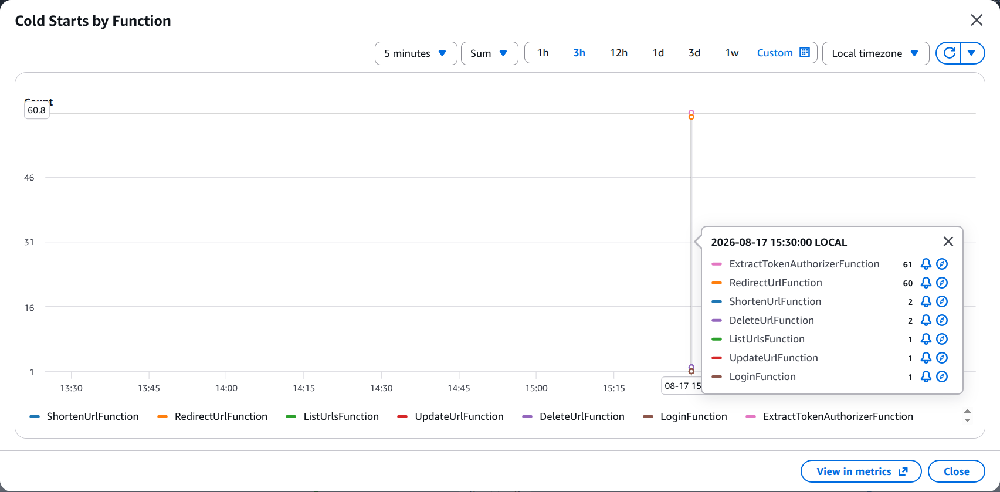

# Scaling & Load Test Results

| | |
|---|---|
| Report covers | 2026-08-16 (baseline) – TBD (capstone date) |
| Branch / commit range | TBD |
| Deployed stack | tylink — us-east-1 (HTTP API `ykcjzugdpb`) |
| Harness | `scripts/load-test/` (`realistic.js`, `stress.js`, `lib.js`) |

## Summary

TBD — filled in once the capstone run (§6) completes.

- **Measured capacity**: TBD RPS at p99 < 1000ms
- **Bottleneck found**: TBD
- **SLO pass/fail**:

| SLO | Target | Result |
|---|---|---|
| N1 — hot-key redirect | p99 < 1000ms | TBD |
| N1 — cold-key redirect | p99 < 1000ms | TBD |
| N1 — auth+CRUD | p99 < 1000ms | TBD |
| N5 — cost guardrail | ~$15–20/mo | TBD |

## Methodology

- **SLO used in this report**: **p99 < 1000ms**
- **Profiles**: `realistic.js` for the baseline test, and  `stress.js` to find peek capacity
- **Scenarios**: `hot` (cache hit),
  `cold` (cache miss), `crud` (low risk endpoints)
- **One variable at a time**: each technique below is applied alone, then the same
  `realistic.js` run is repeated, before moving to the next
- **Evidence capture**: log an ISO start/end timestamps as a time range to monitor and trace

## Baseline

Real run: **2026-08-16, ~06:43–07:45 UTC**

**First bottleneck identified: Concurrent execution of Lambda hits quota. The default of deploy account is 10 instead of 1000
- `Total Throttles`: 2125 (mostly from custom JWT authorizer)

First call results per function:

| Metric | Redirect | Shorten | List | Update | Delete |
|---|---|---|---|---|---|
| Succeeded invocations | 5144 | 118 | 119 | 122 | 121 |
| Throttled | 673 | 6 | 19 | 12 | 9 |
| Throttle rate | 11.6% | 4.8% | 13.8% | 9.0% | 6.9% |
| p50 | 14.4ms | 88.72ms | 39.73ms | 39.23ms | 37.57ms |
| p90 | 39.9ms | 149.45ms | 75.36ms | 63.99ms | 69.17ms |
| p99 | 84.9ms | 4436.03ms | 3920.12ms | 3908.92ms | 4063.25ms |
| Errors | 0 | 0 | 0 | 0 | 0 |

After increasing concurrent quota to 1000:

| Function | Throttled (Before) | Throttled (After) | p50 (Before) | p50 (After) | p90 (Before) | p90 (After) | p99 (Before) | p99 (After) |
|---|---|---|---|---|---|---|---|---|
| Redirect | 673 | 0 | 14.4ms | 19.1ms | 39.9ms | 64.9ms | 84.9ms | <span style="color:red">4152.8ms</span> |
| Shorten | 6 | 0 | 88.72ms | 129.13ms | 149.45ms | 4705.78ms | 4436.03ms | 4971.61ms |
| List | 19 | 0 | 39.73ms | 54.98ms | 75.36ms | 3910.17ms | 3920.12ms | 4373.90ms |
| Update | 12 | 0 | 39.23ms | <span style="color:red">3686.97ms</span> | 63.99ms | 4291.09ms | 3908.92ms | <span style="color:red">4398.14ms</span> |
| Delete | 9 | 0 | 37.57ms | 39.23ms | 69.17ms | 79.42ms | 4063.25ms | <span style="color:red">4168.10ms</span> |

**Flag**
- Throttling hides the real latency — Update's p50 and p99, Redirect's p99, and the wide
  gap between Delete's p90 and p99 all shift once the fix lands.
- Cold starts pile up once the concurrency quota is unblocked: pre-fix, the ~10-container
  cap kept a small pool warm and reused, so throttling suppressed the *opportunity* for
  cold starts rather than the requests being genuinely fast at scale. Once the limit lifted, many new containers had to warm up at once

**Evidence**:  CloudWatch/Service queries

<details>
<summary>Raw k6 summary — baseline</summary>

No k6 stdout/JSON output was captured for this run (checked, none exists on disk). The
CloudWatch/Service Quotas evidence above substitutes for it here.

</details>

---

## Iterative Techniques

### 1. SnapStart

Full investigation at `docs/technical_decisions/14-snapstart-restore-level.md`.

**Before → After**

| Metric | Before (hot) | After (hot) | Before (cold) | After (cold) | Before (crud) | After (crud) |
|---|---|---|---|---|---|---|
| p50 | 284.79ms | 284.85ms | 285.02ms | 284.2ms | 332.87ms | 335.4ms |
| p90 | 320.05ms | 319.14ms | 321.17ms | 316.84ms | 397.48ms | 409.49ms |
| p99 | 9.6s | 5.75s | 9.55s | 5.79s | 7.34s | 4.37s |
| Lambda `Init Duration` (avg) | 2398.87ms† | N/A — SnapStart replaces Init Duration with Restore Duration | 2398.87ms† | N/A | 2280.60–2686.94ms‡ | N/A |
| Lambda `Errors` | 0 | 0 | 0 | 0 | 0 | 0 |

**History**
- Enable SnapStart but first DynamoDB call > 1s. There is something called "SDK Cold start" which occurs in cold environment
- Use connection priming to warm up SDK. Latency reduced but it still high.
- **Root cause**: a restore invocation on Redirect or the Authorizer costs
~2.2–2.9s end-to-end (`Restore Duration` + `Duration`), dominated by platform/JVM-level restore cost.

**Evidence**:



**Verdict**: JVM is a significant overhead. SnapStart & Connection-priming roughly halves p99 but it does not meet the SLO
<details>
<summary>Raw k6 summary — SnapStart before/after</summary>

BEFORE (2026-08-17T08:31:35.855Z – 2026-08-17T08:33:48.867Z):

```
     scenarios: (100.00%) 3 scenarios, 64 max VUs, 2m30s max duration (incl. graceful stop):
              * auth_crud: Up to 5 looping VUs for 2m0s over 1 stages (gracefulRampDown: 30s, exec: authCrud, gracefulStop: 30s)
              * cold_key_redirect: 30.00 iterations/s for 1m0s (maxVUs: 10-30, exec: coldRedirect, gracefulStop: 30s)
              * hot_key_redirect: 30.00 iterations/s for 1m0s (maxVUs: 10-30, exec: hotRedirect, gracefulStop: 30s)

INFO[0000] load-test start: 2026-08-17T08:31:35.855Z     source=console
WARN[0009] Insufficient VUs, reached 30 active VUs and cannot initialize more  executor=constant-arrival-rate scenario=cold_key_redirect
WARN[0009] Insufficient VUs, reached 30 active VUs and cannot initialize more  executor=constant-arrival-rate scenario=hot_key_redirect
INFO[0133] load-test end: 2026-08-17T08:33:48.867Z       source=console

  █ THRESHOLDS
    http_req_duration{scenario:cold}
    ✗ 'p(99)<1000' p(99)=9.55s
    http_req_duration{scenario:crud}
    ✗ 'p(99)<1000' p(99)=7.34s
    http_req_duration{scenario:hot}
    ✗ 'p(99)<1000' p(99)=9.6s

  █ TOTAL RESULTS
    checks_total.......: 3289    24.726884/s
    checks_succeeded...: 100.00% 3289 out of 3289
    checks_failed......: 0.00%   0 out of 3289

    HTTP
    http_req_duration..............: avg=480.6ms  min=257.41ms med=286.05ms max=12.85s p(90)=330.58ms p(95)=355.81ms
      { scenario:cold }............: avg=473.33ms min=261.91ms med=285.02ms max=10.07s p(90)=321.17ms p(95)=340.41ms
      { scenario:crud }............: avg=549.7ms  min=257.41ms med=332.87ms max=12.85s p(90)=397.48ms p(95)=434.31ms
      { scenario:hot }.............: avg=472.75ms min=260.1ms  med=284.79ms max=10.26s p(90)=320.05ms p(95)=337.57ms
    http_req_failed................: 1.79%  59 out of 3290
    http_reqs......................: 3290   24.734402/s

    EXECUTION
    dropped_iterations.............: 549    4.127412/s
    iterations.....................: 3112   23.396188/s
    vus_max........................: 64     min=24         max=64
```

AFTER (2026-08-18T04:41:46.468Z – 2026-08-18T04:43:54.042Z), CRaC connection-priming applied:

```
     scenarios: (100.00%) 3 scenarios, 64 max VUs, 2m30s max duration (incl. graceful stop):
              * auth_crud: Up to 5 looping VUs for 2m0s over 1 stages (gracefulRampDown: 30s, exec: authCrud, gracefulStop: 30s)
              * cold_key_redirect: 30.00 iterations/s for 1m0s (maxVUs: 10-30, exec: coldRedirect, gracefulStop: 30s)
              * hot_key_redirect: 30.00 iterations/s for 1m0s (maxVUs: 10-30, exec: hotRedirect, gracefulStop: 30s)

INFO[0000] load-test start: 2026-08-18T04:41:46.468Z     source=console
WARN[0007] Insufficient VUs, reached 30 active VUs and cannot initialize more  executor=constant-arrival-rate scenario=cold_key_redirect
WARN[0007] Insufficient VUs, reached 30 active VUs and cannot initialize more  executor=constant-arrival-rate scenario=hot_key_redirect
INFO[0127] load-test end: 2026-08-18T04:43:54.042Z       source=console

  █ THRESHOLDS
    http_req_duration{scenario:cold}
    ✗ 'p(99)<1000' p(99)=5.79s
    http_req_duration{scenario:crud}
    ✗ 'p(99)<1000' p(99)=4.37s
    http_req_duration{scenario:hot}
    ✗ 'p(99)<1000' p(99)=5.75s

  █ TOTAL RESULTS
    checks_total.......: 3502    27.450547/s
    checks_succeeded...: 100.00% 3502 out of 3502
    checks_failed......: 0.00%   0 out of 3502

    HTTP
    http_req_duration..............: avg=396.61ms min=258.32ms med=285.7ms  max=6.56s  p(90)=330.93ms p(95)=357.3ms
      { scenario:cold }............: avg=393.64ms min=260.5ms  med=284.2ms  max=6.55s  p(90)=316.84ms p(95)=340.08ms
      { scenario:crud }............: avg=415.86ms min=262.21ms med=335.4ms  max=6.16s  p(90)=409.49ms p(95)=451.18ms
      { scenario:hot }.............: avg=393.91ms min=258.32ms med=284.85ms max=6.56s  p(90)=319.14ms p(95)=337.48ms
    http_req_failed................: 1.85%  65 out of 3503
    http_reqs......................: 3503   27.458385/s

    EXECUTION
    dropped_iterations.............: 360    2.821872/s
    iterations.....................: 3307   25.922032/s
    vus_max........................: 64     min=24         max=64
```

`http_req_failed` (1.85%) is k6's default flagging of the CRUD scenario's `410 Gone`
delete-verification responses as "failed" (any status ≥400) — the script's own `check()`
already treats 410 as expected there; confirmed via API Gateway access logs, no 5xx in this
run.

</details>

### 2. CloudFront edge caching (read latency / hot keys)

**What changed**: TBD (include the cache-freshness/invalidation trade-off decision made —
short `max-age` + explicit invalidation on update/delete, or accepted bounded staleness)

**Hypothesis**: Hot-key redirect latency drops sharply (served from the edge, Lambda
removed from the hot path); cold-key redirect is largely unaffected.

**Before → After**

| Metric | Before (hot) | After (hot) | Before (cold) | After (cold) | Before (crud) | After (crud) |
|---|---|---|---|---|---|---|
| p50 | TBD | TBD | TBD | TBD | TBD | TBD |
| p90 | TBD | TBD | TBD | TBD | TBD | TBD |
| p99 | TBD | TBD | TBD | TBD | TBD | TBD |
| CloudFront cache hit ratio | TBD | TBD | TBD | TBD | — | — |
| Error rate | TBD | TBD | TBD | TBD | TBD | TBD |

**Cost delta**: TBD

**Failure-mode change**: TBD

**Evidence**: TBD

**Verdict**: TBD

<details>
<summary>Raw k6 summary — CloudFront caching before/after</summary>

```
TBD
```

</details>

### 3. DynamoDB capacity mode (on-demand vs. provisioned+autoscaling)

**What changed**: TBD

**Hypothesis**: On-demand absorbs the load profile's bursts with fewer throttles than
provisioned+autoscaling, which reacts on a lag.

**Before → After**

| Metric | Before (hot) | After (hot) | Before (cold) | After (cold) | Before (crud) | After (crud) |
|---|---|---|---|---|---|---|
| p50 | TBD | TBD | TBD | TBD | TBD | TBD |
| p90 | TBD | TBD | TBD | TBD | TBD | TBD |
| p99 | TBD | TBD | TBD | TBD | TBD | TBD |
| `ConsumedReadCapacityUnits` / throttle count | TBD | TBD | TBD | TBD | TBD | TBD |
| Error rate | TBD | TBD | TBD | TBD | TBD | TBD |

**Cost delta**: TBD

**Failure-mode change**: TBD

**Evidence**: TBD

**Verdict**: TBD

<details>
<summary>Raw k6 summary — capacity mode before/after</summary>

```
TBD
```

</details>

### 4. Throttling / backpressure

**What changed**: TBD (API Gateway per-route/stage rate & burst limits, client/SDK
exponential backoff+jitter, reserved concurrency)

**Hypothesis**: A spike no longer starves other routes or piles up against DynamoDB;
excess load is rejected/backed off instead of degrading every caller's latency.

**Before → After**

| Metric | Before (hot) | After (hot) | Before (cold) | After (cold) | Before (crud) | After (crud) |
|---|---|---|---|---|---|---|
| p50 | TBD | TBD | TBD | TBD | TBD | TBD |
| p90 | TBD | TBD | TBD | TBD | TBD | TBD |
| p99 | TBD | TBD | TBD | TBD | TBD | TBD |
| 429 rate | TBD | TBD | TBD | TBD | TBD | TBD |
| Error rate | TBD | TBD | TBD | TBD | TBD | TBD |

**Cost delta**: TBD

**Failure-mode change**: TBD

**Evidence**: TBD

**Verdict**: TBD

<details>
<summary>Raw k6 summary — throttling before/after</summary>

```
TBD
```

</details>

---

## Capstone Stress-to-Failure Run

`stress.js` run against the deployed stack (`docs/plans/03-load-testing.md` step 7), after all
four techniques above are applied. Optionally run once via the AWS Distributed Load
Testing solution for a larger-scale confirmation, then torn down immediately
(`docs/plans/00-overview.md` stack table).

- **Measured capacity**: TBD RPS at p99 < 1000ms
- **Scenario that broke first**: TBD
- **Stage executing at break**: TBD (one of 50 / 100 / 200 / 400 req/s)
- **X-Ray highest-latency node at that point**: TBD (Lambda init / DynamoDB call / API
  Gateway overhead)
- **One-time run cost**: TBD

**Evidence**: TBD

<details>
<summary>Raw k6 summary — capstone stress run</summary>

```
TBD
```

</details>

## Bottleneck Analysis

TBD — the actual root-cause bottleneck at the capacity limit found above, not just the
number.

## Beyond This Project

Next scaling steps not built here, per `docs/plans/03-load-testing.md` step 7:

| Option | When it would actually be needed |
|---|---|
| DynamoDB Accelerator (DAX) | If a real per-request-side-effect / hot-key read problem remains after CloudFront caching |
| DynamoDB Global Tables | Multi-region / DR — out of scope for a single-region deployment |
| Provisioned concurrency (replacing SnapStart) | Confirmed needed, not just hypothetical — §1 shows SnapStart + connection-priming alone doesn't bound p99 under this project's burst load. AWS does not support SnapStart and provisioned concurrency together on the same version/alias, so this means switching off SnapStart on these functions, not adding PC alongside it — next step if this work continues |

## Appendix — Run Timestamp Windows

Exact UTC windows used for CloudWatch/X-Ray correlation, per run.

| Run | Start (UTC) | End (UTC) |
|---|---|---|
| Baseline | 2026-08-16T06:43:00Z | 2026-08-16T07:45:00Z |
| SnapStart — before | 2026-08-17T08:31:35Z | 2026-08-17T08:33:49Z |
| SnapStart — after | 2026-08-18T04:41:46Z | 2026-08-18T04:43:54Z |
| CloudFront caching — before | TBD | TBD |
| CloudFront caching — after | TBD | TBD |
| Capacity mode — before | TBD | TBD |
| Capacity mode — after | TBD | TBD |
| Throttling — before | TBD | TBD |
| Throttling — after | TBD | TBD |
| Capstone stress run | TBD | TBD |
